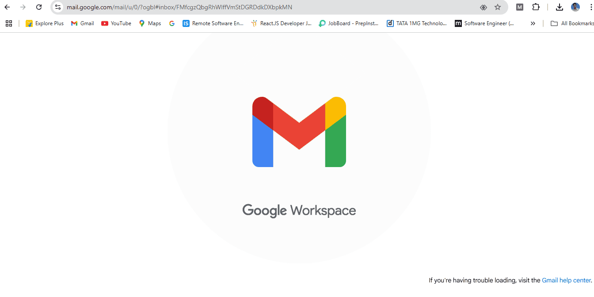

<h1>Mail Mind - AI</h1>

# Logo Craft (Design Logo as You Like)

LogoCraft - A Powerful Logo Creation App
LogoCraft is a React + Vite application designed for quick and efficient logo creation. Built with modern tools like Tailwind CSS, ShadCN library, and Lucide Icons, it offers an intuitive design experience with customizable components. Key features include an advanced gradient color picker, shape customization, and dynamic logo adjustments. The app utilizes html2Canvas to enable seamless logo downloads. The project also incorporates a Vite server proxy for enhanced performance and scalability. Perfect for designers looking to craft logos effortlessly!
## 🎥 Demo

## 📸 Screenshots

